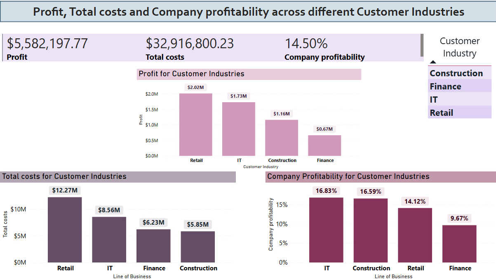
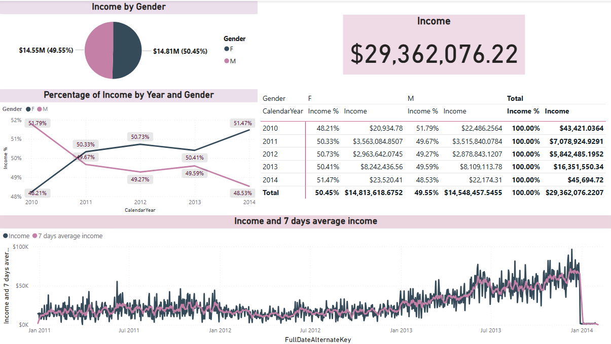

# 📊 Power BI Data Analysis Projects

This repository contains two Power BI projects focused on business data analysis using Excel files and SQL Server databases. Both projects demonstrate the use of data modeling, DAX measures, and interactive reporting to support decision-making in different business contexts.

---

## 📁 Projects Overview

### 1️⃣ Data Analysis and Reporting – Profitability Insights  
**Purpose:** Financial analysis of internal projects using Excel datasets  
**Focus:** Cost breakdown, profitability KPIs, and non-profitable project detection  
📂 [`data-analysis-and-reporting`](./data-analysis-and-reporting)

**🔍 Key Features:**
- Custom DAX for costs, profit, profitability
- Breakdown by project, industry, type, city, and time
- Filtered view of non-profitable projects
- One-page business dashboard

---

### 2️⃣ Power BI & MS SQL Server
**Purpose:** Business intelligence reporting using SQL Server data warehouse  
**Focus:** Sales metrics, promotional impact, geographic trends  
📂 [`power-bi-and-ms-sql-server`](./power-bi-and-ms-sql-server)

**🔍 Key Features:**
- Direct connection to SQL Server database
- Measures: income, margin, % margin, avg. order value
- Analysis by country, gender, promotion, and time
- Time series and share-of-income visualizations

---

## 🛠️ Tech Stack

- Power BI  
- MS SQL Server 
- Excel 
- DAX (Data Analysis Expressions)
