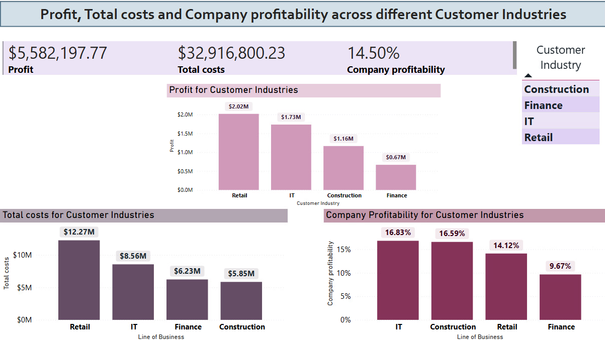

# 📈 Data Analysis and Reporting – Profitability Insights in Power BI

## 🎯 Purpose

The goal of this project was to analyze project-related financial data using Power BI, focusing on **profitability**, **cost management**, and **project performance**.
The final result includes a dynamic report highlighting profitable and non-profitable projects across various business dimensions.

---

## 🛠️ Tech Stack

- **Microsoft Power BI**
- **Microsoft Excel (source files)**
- **DAX (Data Analysis Expressions)**
  
---

## ✨ Features

- 🧹 **Data Quality Improvement**  
  Cleaned and prepared datasets before modeling.

- 🔗 **Data Modeling**  
  Connected multiple tables with defined relationships to build a star schema model.

- 📐 **Custom Measures**  
  Developed key financial indicators using DAX:
  - **Total Costs** = Labor Costs + External Costs
  - **Profit** = Income – Costs
  - **Profitability (%)** = Profit / Income

- 🧭 **Profitability Analysis Across Dimensions**  
  Report views filtered by:
  - Project
  - Project Type
  - Customer Industry
  - City
  - Time (Calendar Dimension)

- ❗ **Non-Profitable Projects Detection**  
  Automatically filters and displays projects where **costs ≥ income**.
  
---

### 🔹 Overview Dashboard

