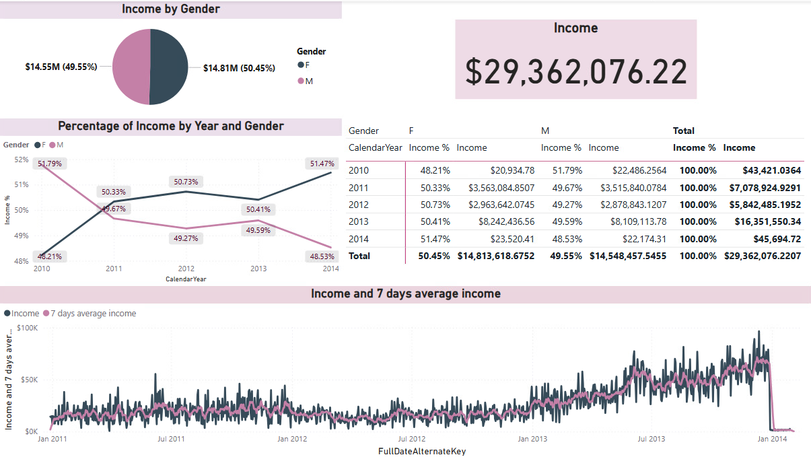

# 📊 Power BI & MS SQL Server 

## 🎯 Purpose

This project was developed as part of a business intelligence assignment to showcase advanced data modeling, DAX calculations, and visualization capabilities in Power BI using a relational SQL Server database.

The goal was to extract actionable insights from the dataset, focusing on profitability, sales trends, and customer behavior across geographic and demographic dimensions.

It demonstrates how Power BI can support data-driven decision-making in a real-world sales environment.

---

## 🛠️ Tech Stack

- **Microsoft Power BI**
- **Microsoft SQL Server**
- **DAX (Data Analysis Expressions)**
- **Data Warehouse schema** 

---

## ✨ Features

- 📥 **Data Integration**  
  Connected Power BI to SQL Server and imported tables:
  - `FactInternetSales`
  - `DimCustomer`
  - `DimGeography`
  - `DimProduct`, `DimProductCategory`, `DimProductSubcategory`
  - `DimPromotion`

- 📐 **Custom Measures & KPIs**  
  Created DAX measures for:
  - Total Income
  - Margin & % Margin
  - Quantity Sold
  - Number of Orders
  - Average Order Value

- 📊 **Business Question Analysis**
  - In which country is the **percentage margin** highest?
  - How does margin **change over time**?
  - Which **promotion** generated the most orders?
  - Who places more orders – **males or females**, and in which countries?
  - What is each country’s **share in total income**?
  - How does the **average order value** change over time?

- 📈 **Visual Dashboard**  
  Interactive visualizations and time series analysis using appropriate chart types
  
